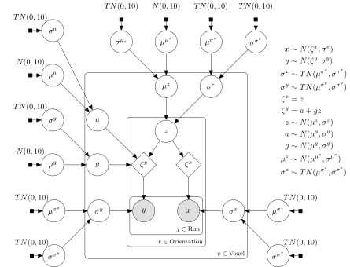

```{r, include = FALSE}
knitr::opts_chunk$set(
  collapse = TRUE,
  comment = "#>")
```

```{r setup}
library(nmmr)
library(tidyr)
library(ggplot2)
library(dplyr)
library(forcats)

set.seed(1234)
```


# Introduction

In a [previous vignette](https://psadil.github.io/nmmr/articles/orthogonal.html), we saw that neuromodulation was indexed with a scatterplot of voxel activity at high- versus low-contrast. This provided a quick way to differentiate between an additive offset and multiplicative gain. However, that method required an _ad hoc_ preprocessing step, excluding poorly tuned voxels, to produce reasonable estimates of slopes. 

# Hierarchical Bayesian Deming Regression

## The Model

The model is very similar to the model underlying orthogonal regression, but for two important changes. First, the model is hierarchical. That is, whereas we previously ran a separate orthogonal regression on each voxel, we now estimate each of the separate slope, intercept, and noise terms in a single regression model^[If hierarchical modeling is unfamiliar, see [here](https://mc-stan.org/rstanarm/articles/pooling.html) for a brief introduction.]. Second, we relax the assumption that the variance in both observed variables (e.g., voxel activity at high and low contrast) is equal^[The terminology ["Deming"](https://en.wikipedia.org/wiki/Deming_regression) refers to this later relaxation.]. 

The paper has full details of the model, but a schematic [plate diagram](https://en.wikipedia.org/wiki/Plate_notation) is is reproduced here.

```{r, tikz-ex, echo=FALSE, out.width = "100%", fig.cap = 'Schematic of the Bayesian model. Filled square nodes indicate priors, open circles are estimated parameters, the shaded circles are observed data, and the open diamond is the result of a deterministic function of the parameters. Nodes are grouped with the square "plates", indicating over which subsets of the data the node is replicated. The distribution assigned to each node is listed to the right of the diagram. $N(\\mu,\\sigma)$ is a normal with location $\\mu$ and scale $\\sigma$, and $TN(\\mu,\\sigma)$ is a normal with the same parameters, truncated below at $\\mu$. Each equation in the upper right is associated with an arrow in the diagram, describing a relationship between nodes.', fig.ext='svg'}

```

## Stan Code

The hierarchical Deming regression model is bundled with `nmmr`. As before, the data need to be in a wider format. Additionally, the tuning variable (e.g., `orientation`) should be converted into a `factor`.

```{r, wider}
sub02_wide <- sub02 %>%
  pivot_wider(names_from = contrast, values_from = y) %>%
  mutate(orientation = factor(orientation))
```

For the purposes of this vignette, we reduce the dataset down to just 100 voxels. This is only to speed up the estimation process. 

```{r, small}
small <- sub02_wide %>%
  group_by(orientation, run, ses) %>%
  slice_head(n = 5) %>%
  mutate(voxel = fct_drop(voxel)) %>%
  ungroup() 
```

The model can be implemented by initializing an object provided by the `nmmr` package of class [`Deming`](https://psadil.github.io/nmmr/reference/Deming.html). As with orthogonal regression, the [`$new()`](https://psadil.github.io/nmmr/reference/Deming.html#method-new) method takes a dataset and the names of the columns with the two dependent variables. Additionally, the class needs to know which column containing the tuning variable (e.g., the orientation associated with each observation), and the column indexing voxel (e.g., voxel). 

```{r, stancode}
m <- Deming$new(small, low, high, tuning_var = orientation, voxel_var = voxel)
```

The newly created object, `m`, is an [`R6`](https://r6.r-lib.org/) object of class [`Deming`](https://psadil.github.io/nmmr/reference/Deming.html). It can be thought of as a wrapper around a `cmdstanr::CmdStanModel` class, but one which does a bit of extra prep work to clean up the data and prepare it for sampling. The underlying Stan model can be accessed with the [`$print()`](https://mc-stan.org/cmdstanr/reference/CmdStanModel.html#methods) method of the `cmdstanmodel` field.^[This model is also available on the `nmmr` repository, [here](https://github.com/psadil/nmmr/blob/main/inst/stan/deming.stan).]

```{r, print_model}
m$cmdstanmodel
```

Note that, in the model, the names of the parameters were chosen to match the names in the schematic, above. For example, the parameter `g` is the voxel-specific slope. The hierarchy on the slope assumes that each individual voxel's slope comes from a population distribution, which in this case is normal with mean `g_mu` (written in the diagram $\mu^g$) and standard deviation `g_sigma` (written in the diagram as $\sigma^g$).

The object contains a method called [`$sample()`](https://psadil.github.io/nmmr/reference/Deming.html#method-sample), which accepts all of the arguments as does the [`$sample()`](https://mc-stan.org/cmdstanr/reference/model-method-sample.html) method of `cmdstanr::CmdStanModel`. Here, we run three chains in parallel, set the random number generator seed, and increase adapt delta to 0.9.^[Increasing the "adapt delta" parameter will likely cause the model to run more slowly, but also avoid divergences. With only 100 voxels, there is not quite enough data to wrangle the posterior with the default sampler settings.  When working with a larger dataset (e.g., 1000+ voxels), the default sampling parameters (i.e., `adapt_delta = 0.8`) may be sufficient.
]

```{r, fit}
fit <- m$sample(
  chains = 2, 
  parallel_chains = 2, 
  seed = 1)
```

The initial messages "The current Metropolis proposal is about to be rejected [...]" can safely be ignored. However, if you see warnings about either divergences or maximum treedepth, be wary. For a brief introduction to these warnings, [see here](https://mc-stan.org/misc/warnings.html). You can try setting adapt_delta to a higher number, but if you reach a value like 0.99 and still encounter divergences, then it is likely that there is a deeper issue, a conflict between the model and your data. 

Such conflicts are beyond the scope of this vignette, and the `nmmr` package. If increasing adapt delta does not eliminate the sampling warnings, feel free to file an issue on the [github repository](https://github.com/psadil/nmmr/issues). It may be possible to tailor the model to your dataset.

## Analyzing Results

The [`$sample()`](https://psadil.github.io/nmmr/reference/Deming.html#method-sample) method returns a `cmdstanr::CmdStanMCMC` object. For example, we can look at a quick summary of the population-level parameters for the slope (`g_mu` and `g_sigma`), the intercept (`a_mu` and `a_sigma`), the noise at low contrast (`x_sigma_mu` and `x_sigma_sigma`), and the noise at high contrast (`y_sigma_mu` and `y_sigma_sigma`).

```{r, quick_summary}
fit$summary(c("g_mu", "g_sigma",
              "a_mu", "a_sigma",
              "x_sigma_mu", "x_sigma_sigma",
              "y_sigma_mu", "y_sigma_sigma"))
```

Additionally, we can make use of the many other packages that compose the Stan ecosystem.  For example, [`bayesplot`](https://mc-stan.org/bayesplot/) has many resources for plotting posterior distributions. The following shows a pairs plot, useful for seeing whether parameters in the posterior tradeoff.

```{r, pairs, fig.cap="These parameters do not exhibit strong correlations."}
bayesplot::mcmc_pairs(
  fit$draws(c("g_mu", "g_sigma",
             "x_sigma_mu", "x_sigma_sigma",
             "y_sigma_mu", "y_sigma_sigma")))
```


For digging deeper into the model, other packages from the Stan development team will be useful. For example, if you have [`RStan`](https://mc-stan.org/rstan/) installed, you can use the function [`rstan::read_stan_csv()`](https://mc-stan.org/rstan/reference/stan_csv.html) to reformat the results and use [`shinystan`](https://mc-stan.org/shinystan/).^[Alternatively, you can use [`shinystan`](https://mc-stan.org/shinystan/) without installing [`RStan`](https://mc-stan.org/rstan/) by instead installing the development version of [`shinystan`](https://mc-stan.org/shinystan/). See https://github.com/stan-dev/shinystan/issues/184.]

```{r, eval=FALSE}
stanfit <- rstan::read_stan_csv(fit$output_files())
shinystan::launch_shinystan(stanfit)
```

When applying this model to your data, it is a good idea to browse through these plots. For now, focus on the three main parameters of interest, the average noise at low and high contrast (`x_sigma_mu` and `y_sigma_mu`), and the average slope (`g_mu`). For ease of plotting, convert them into a `tibble::tibble`.

```{r, draws}
draws <- fit$draws(c("g_mu", "x_sigma_mu","y_sigma_mu")) %>%
  posterior::as_draws_df() %>%
  as_tibble() 
```

Now use [`tidyverse`](https://www.tidyverse.org/) packages to plot the posteriors. For example, we can look at whether there is evidence that the noise differs across levels of contrast.

```{r, post_noise, fig.cap="These data provide some evidence that noise increases at high contrast, but the posteriors are not precise enough to be confident."}
draws %>%
  select(-g_mu) %>%
  pivot_longer(cols = contains("sigma"), names_to = "Contrast", values_to = "Noise") %>%
  mutate(
    Contrast = factor(
      Contrast, 
      levels = c("x_sigma_mu", "y_sigma_mu"),
      labels = c("Low", "High"))) %>%
  ggplot(aes(x=Noise, fill=Contrast)) +
  geom_histogram(bins=50, position = position_dodge()) 
```

Finally, what is the average slope? 

```{r, post_slope, fig.cap="In support of multiplicative gain, the average slope appears to be larger than 1."}
draws %>%
  select(-contains("sigma"), Slope = "g_mu") %>%
  ggplot(aes(x = Slope)) +
  geom_histogram(bins = 50) +
  coord_cartesian(xlim = c(0.5, 1.5))

```

Since multiplicative gain but not additive offset predict a slope larger than 1, these data provide more evidence that contrast causes multiplicative neuromodulation.

